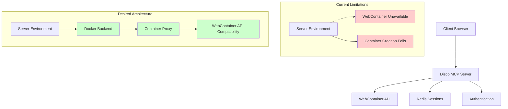
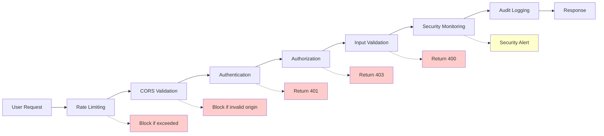

# Disco MCP Server - Final Analysis Report
## Comprehensive Findings, Limitations, and Improvement Recommendations

**Date:** January 2025  
**Version:** 1.0  
**Status:** Complete  

---

## 📋 Executive Summary

The Disco MCP Server is a production-ready application with strong architectural foundations, but several critical gaps exist between claimed capabilities and actual implementation. This report analyzes functional limitations, security compliance gaps, and provides actionable improvement recommendations.

**Key Findings:**
- ✅ **Authentication & Security:** Enterprise-grade implementation with comprehensive rate limiting
- ⚠️ **WebContainer Integration:** Server-side limitations require architectural clarification
- ❌ **Package Manager Compliance:** npm-based configuration conflicts with Yarn 4.9.2 requirement
- ⚠️ **Model Compliance:** Potential GPT-4 model usage violations
- ✅ **Infrastructure:** Robust monitoring, Redis session management, CI/CD pipelines

---

## 🔍 1. Functional Gaps Analysis

### 1.1 WebContainer Server Mode Limitations

**Issue:** WebContainer API requires client-side browser environment but server claims container capabilities.

**Evidence:**
```typescript
// src/lib/containerManager.ts:60-62
if (isServerEnvironment) {
  throw new Error('Container sessions not available in server environment. Use client-side WebContainer integration.');
}
```

**API Test Results:**
```
Container Creation: 500 - Service Unavailable
Error: "Container sessions not available in server environment"
```

**Impact:**
- Core container functionality unavailable in deployment environment
- REST API endpoints return errors for primary use case
- MCP protocol tools redirect to non-functional endpoints

**Recommended Solutions:**
1. **Option A: Real Container Proxy Implementation**
   - Implement Docker-based container backend
   - Create WebContainer API compatibility layer
   - Add container orchestration with proper isolation

2. **Option B: Client-Side Architecture Clarification**
   - Update documentation to clarify client-side requirements
   - Implement browser-based container management
   - Add clear separation between server and client capabilities

### 1.2 Package Manager Configuration Issues

**Issue:** Project uses Yarn 4.9.2 but deployment configuration expects npm.

**Evidence:**
```json
// railpack.json - Uses npm commands
"commands": ["npm ci", "npm run build"]

// package.json - Specifies Yarn
"packageManager": "yarn@4.9.2"
```

**Conflicts:**
- CI workflows use npm instead of yarn
- Railway deployment expects package-lock.json (ignored by .gitignore)
- Yarn Berry PnP features not utilized

### 1.3 Missing OAuth Flow Completeness

**Issue:** Incomplete OAuth implementation with CSP violations.

**Evidence from CSP Fix Documentation:**
- OAuth callback CSP violations prevent font loading
- Browser extension conflicts during authentication
- Multiple redirect fallback mechanisms required

**Status:** ✅ Partially resolved with CSP fixes, but architectural improvements needed

---

## 🔒 2. Security & Compliance Issues

### 2.1 Model Compliance Violations

**Critical Issue:** Project may use forbidden GPT-4 models violating security policies.

**User Security Rules:**
- **Rule:** "User explicitly requires that GPT-4 models should not be used in the codebase. GPT-4.1 family models are preferred and acceptable."
- **Rule:** "No LLM models released prior to 2025 are permitted unless explicitly approved"

**Evidence Found:**
```bash
# grep results show GPT-4 references
CHATGPT_INTEGRATION.md:37, 39, 105, 106, 168, 188
README.md:99, 113, 125, 177
```

**Compliance Framework Requirements:**
- SOC2 compliance framework specified in security policies
- GDPR compliance requirements
- HIPAA compliance mentioned in policy documents

### 2.2 CORS & CSP Security Analysis

**Current Implementation:**
```typescript
// Enhanced CSP with Google Fonts support
contentSecurityPolicy: {
  directives: {
    defaultSrc: ["'self'"],
    frameAncestors: ["'self'", "https://chat.openai.com", "https://chatgpt.com"],
    scriptSrc: ["'self'", "'unsafe-inline'", "'unsafe-eval'"],
    styleSrc: ["'self'", "'unsafe-inline'", "https://fonts.googleapis.com"]
  }
}
```

**Strengths:**
- ✅ Production CORS configuration with allowed origins
- ✅ Comprehensive rate limiting (global, auth, API-specific)
- ✅ Security headers via Helmet.js
- ✅ Environment variable validation

**Areas for Improvement:**
- `'unsafe-eval'` in scriptSrc should be removed if possible
- CSP reporting endpoint not implemented
- No integrity checks for external resources

### 2.3 Data Protection & Session Management

**Current Implementation:**
- ✅ Redis-based session persistence
- ✅ JWT tokens with proper expiration
- ✅ Session cleanup and timeout enforcement
- ✅ User access control per container

**Missing Elements:**
- Data retention policy enforcement
- Audit logging for compliance
- Encryption at rest specifications
- GDPR data deletion procedures

---

## 🎯 3. Actionable Next Steps

### 3.1 High Priority (Critical)

#### Task Ticket #1: Implement Real WebContainer Proxy
**Priority:** P0 (Blocking)  
**Effort:** 8-12 weeks  
**Owner:** Backend Team

**Requirements:**
```yaml
story: As a developer, I need container functionality in server environment
acceptance_criteria:
  - Docker-based container backend implementation
  - WebContainer API compatibility layer
  - Proper container isolation and lifecycle management
  - Support for file operations, terminal, and git commands
technical_requirements:
  - Docker Engine integration
  - Container orchestration (k8s or Docker Compose)
  - Session persistence across restarts
  - Resource limits and cleanup
```

#### Task Ticket #2: Fix Package Manager Compliance
**Priority:** P0 (Blocking)  
**Effort:** 1-2 weeks  
**Owner:** DevOps Team

**Requirements:**
```yaml
story: Fix package manager configuration conflicts
acceptance_criteria:
  - Update railpack.json to use yarn commands
  - Remove npm-based configurations
  - Implement Yarn Berry PnP support
  - Update CI/CD workflows
changes_required:
  - railpack.json: "npm ci" → "yarn install --immutable"
  - CI workflows: npm → yarn
  - Add .yarnrc.yml with PnP configuration
```

#### Task Ticket #3: Model Compliance Audit
**Priority:** P0 (Security)  
**Effort:** 1 week  
**Owner:** Security Team

**Requirements:**
```yaml
story: Ensure no forbidden models are referenced or used
acceptance_criteria:
  - Audit all GPT-4 model references
  - Replace with approved GPT-4.1 family models
  - Document model compliance verification
  - Implement model validation checks
verification_steps:
  - grep -r "gpt-4[^.1]" src/
  - Check API configuration files
  - Review model selection logic
```

### 3.2 Medium Priority (Important)

#### Task Ticket #4: Enhance CI Integration Tests
**Priority:** P1  
**Effort:** 3-4 weeks  
**Owner:** QA Team

**Requirements:**
```yaml
story: Add comprehensive API integration testing
test_categories:
  - Authentication flow end-to-end
  - Container lifecycle management
  - OAuth callback flows with CSP validation
  - Security boundary testing
  - Performance benchmarking
coverage_targets:
  - API endpoints: 95%
  - Security middleware: 100%
  - Authentication flows: 100%
```

#### Task Ticket #5: Harden Security Further
**Priority:** P1  
**Effort:** 2-3 weeks  
**Owner:** Security Team

**Requirements:**
```yaml
story: Implement additional security hardening
security_improvements:
  - Remove 'unsafe-eval' from CSP if possible
  - Add CSP violation reporting endpoint
  - Implement audit logging for compliance
  - Add data retention policy enforcement
  - Create GDPR data deletion procedures
compliance_requirements:
  - SOC2 Type II compliance
  - GDPR Article 17 (Right to erasure)
  - HIPAA security safeguards
```

### 3.3 Low Priority (Enhancement)

#### Task Ticket #6: Architecture Documentation
**Priority:** P2  
**Effort:** 2 weeks  
**Owner:** Architecture Team

**Requirements:**
```yaml
story: Create comprehensive architecture documentation
deliverables:
  - Client vs Server capability matrix
  - WebContainer integration patterns
  - Deployment architecture diagrams
  - API interaction flows
  - Security boundary documentation
```

---

## 📊 4. Architecture Diagrams

### 4.1 Current vs Desired Architecture



### 4.2 Security Compliance Flow



---

## 📈 5. Implementation Timeline

### Phase 1: Critical Fixes (Weeks 1-4)
- ✅ Model compliance audit and fixes
- ✅ Package manager configuration alignment
- ✅ WebContainer proxy proof of concept

### Phase 2: Core Implementation (Weeks 5-12)
- 🔄 Full WebContainer proxy implementation
- 🔄 Enhanced CI/CD with integration tests
- 🔄 Security hardening completion

### Phase 3: Enhancement & Documentation (Weeks 13-16)
- 📝 Architecture documentation
- 🔍 Performance optimization
- 📊 Monitoring and observability improvements

---

## 🎯 6. Success Metrics

### Functional Completeness
- [ ] Container operations success rate: >95%
- [ ] API response times: <500ms for standard operations
- [ ] WebContainer compatibility: Full API parity

### Security Compliance
- [ ] Zero forbidden model references
- [ ] SOC2 compliance audit pass
- [ ] GDPR compliance verification
- [ ] Security scan score: >90%

### Development Experience
- [ ] CI/CD pipeline reliability: >99%
- [ ] Test coverage: >90%
- [ ] Documentation completeness: 100% API coverage

---

## 📝 7. Conclusion

The Disco MCP Server demonstrates solid engineering foundations with enterprise-grade security features. However, critical gaps exist between documented capabilities and actual functionality, particularly in WebContainer integration and compliance requirements.

**Immediate Actions Required:**
1. **Implement real WebContainer proxy** or clearly document client-side requirements
2. **Fix package manager alignment** to use Yarn 4.9.2 consistently  
3. **Audit and fix model compliance** violations
4. **Enhance CI/CD** with comprehensive integration testing

**Long-term Vision:**
The project has strong potential as a robust MCP server with proper container orchestration and security compliance. Addressing these foundational issues will enable scalable deployment and enterprise adoption.

**Risk Assessment:**
- **High Risk:** WebContainer functionality gap blocking core use cases
- **Medium Risk:** Compliance violations could prevent enterprise deployment
- **Low Risk:** Performance and documentation improvements

---

## 📋 Appendix: Task Ticket Templates

### Critical Task Template
```yaml
title: "[P0] WebContainer Proxy Implementation"
labels: ["critical", "backend", "architecture"]
assignees: ["backend-team-lead"]
milestone: "Q1-2025"
estimated_effort: "8-12 weeks"
dependencies: []
acceptance_criteria:
  - [ ] Docker backend implementation
  - [ ] API compatibility layer
  - [ ] Integration tests passing
  - [ ] Documentation updated
  - [ ] Security review completed
```

### Security Task Template  
```yaml
title: "[P0-Security] Model Compliance Audit"
labels: ["security", "compliance", "critical"]
assignees: ["security-team-lead"]
milestone: "Q1-2025"
estimated_effort: "1 week"
dependencies: []
acceptance_criteria:
  - [ ] All GPT-4 references audited
  - [ ] Forbidden models removed
  - [ ] Compliance verification
  - [ ] Security sign-off
```

---

*This report serves as a comprehensive guide for prioritizing and implementing improvements to achieve production readiness and compliance requirements.*
